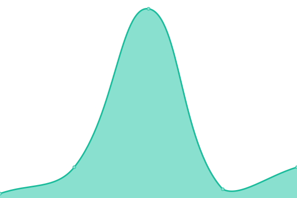
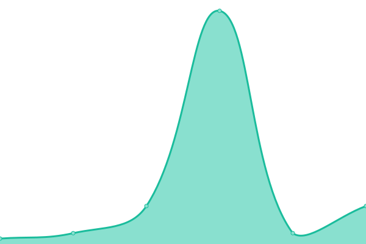

# [📈 Live Status](https://monitor2.ivancarlos.com.br): <!--live status--> **🟧 Partial outage**

This repository contains the open-source uptime monitor and status page for [Ivan Carlos](https://ivancarlos.me).

<!--start: status pages-->
<!-- This summary is generated by Upptime (https://github.com/upptime/upptime) -->
<!-- Do not edit this manually, your changes will be overwritten -->
<!-- prettier-ignore -->
| URL | Status | History | Response Time | Uptime |
| --- | ------ | ------- | ------------- | ------ |
|  [UptimeRobot](https://uptimerobot.com) | 🟩 Up | [uptime-robot.yml](https://github.com/ivancarlos-me/Uptime-by-GitHub/commits/HEAD/history/uptime-robot.yml) | 

 693ms
     
 | 

<a href="https://monitor2.ivancarlos.com.br/history/uptime-robot">100.00%</a>
    

|  [Punto.alerta](https://alerta.org.br) | 🟩 Up | [punto-alerta.yml](https://github.com/ivancarlos-me/Uptime-by-GitHub/commits/HEAD/history/punto-alerta.yml) | 

 2339ms
     
 | 

<a href="https://monitor2.ivancarlos.com.br/history/punto-alerta">100.00%</a>
    

|  [SP4.sp4com](https://sp4com.com.br) | 🟩 Up | [sp-4-sp4com.yml](https://github.com/ivancarlos-me/Uptime-by-GitHub/commits/HEAD/history/sp-4-sp4com.yml) | 

 7982ms
     
 | 

<a href="https://monitor2.ivancarlos.com.br/history/sp-4-sp4com">95.94%</a>
    

|  [SP4.sp4comunicacao](https://sp4comunicacao.com.br/en) | 🟩 Up | [sp-4-sp4comunicacao.yml](https://github.com/ivancarlos-me/Uptime-by-GitHub/commits/HEAD/history/sp-4-sp4comunicacao.yml) | 

 5407ms
     
 | 

<a href="https://monitor2.ivancarlos.com.br/history/sp-4-sp4comunicacao">100.00%</a>
    

|  [Bowler.bowlersv01.v6](bowlersv01.bowler.com.br) | 🟥 Down | [bowler-bowlersv01-v6.yml](https://github.com/ivancarlos-me/Uptime-by-GitHub/commits/HEAD/history/bowler-bowlersv01-v6.yml) | 

 0ms
     
 | 

<a href="https://monitor2.ivancarlos.com.br/history/bowler-bowlersv01-v6">0.00%</a>
    

|  [Punto.puntosv01.v6](puntosv01.puntocomunicacao.com.br) | 🟥 Down | [punto-puntosv01-v6.yml](https://github.com/ivancarlos-me/Uptime-by-GitHub/commits/HEAD/history/punto-puntosv01-v6.yml) | 

 0ms
     
 | 

<a href="https://monitor2.ivancarlos.com.br/history/punto-puntosv01-v6">0.00%</a>
    

|  [Punto.puntosv06.v6](puntosv06.puntocomunicacao.com.br) | 🟥 Down | [punto-puntosv06-v6.yml](https://github.com/ivancarlos-me/Uptime-by-GitHub/commits/HEAD/history/punto-puntosv06-v6.yml) | 

 0ms
     
 | 

<a href="https://monitor2.ivancarlos.com.br/history/punto-puntosv06-v6">0.00%</a>
    

|  [Punto.puntosv07.v6](puntosv07.puntocomunicacao.com.br) | 🟥 Down | [punto-puntosv07-v6.yml](https://github.com/ivancarlos-me/Uptime-by-GitHub/commits/HEAD/history/punto-puntosv07-v6.yml) | 

 0ms
     
 | 

<a href="https://monitor2.ivancarlos.com.br/history/punto-puntosv07-v6">0.00%</a>
    

|  [Punto.puntosv08.v6](puntosv08.puntocomunicacao.com.br) | 🟥 Down | [punto-puntosv08-v6.yml](https://github.com/ivancarlos-me/Uptime-by-GitHub/commits/HEAD/history/punto-puntosv08-v6.yml) | 

 0ms
     
 | 

<a href="https://monitor2.ivancarlos.com.br/history/punto-puntosv08-v6">0.00%</a>
    

|  [Punto.puntosv09.v6](puntosv09.puntocomunicacao.com.br) | 🟩 Up | [punto-puntosv09-v6.yml](https://github.com/ivancarlos-me/Uptime-by-GitHub/commits/HEAD/history/punto-puntosv09-v6.yml) | 

 12ms
     
 | 

<a href="https://monitor2.ivancarlos.com.br/history/punto-puntosv09-v6">100.00%</a>
    

|  [Punto.puntosv10.v6](puntosv10.puntocomunicacao.com.br) | 🟥 Down | [punto-puntosv10-v6.yml](https://github.com/ivancarlos-me/Uptime-by-GitHub/commits/HEAD/history/punto-puntosv10-v6.yml) | 

 0ms
     
 | 

<a href="https://monitor2.ivancarlos.com.br/history/punto-puntosv10-v6">0.00%</a>
    

|  [Punto.oxfamsv01.v6](oxfamsv01.oxfam.org.br) | 🟩 Up | [punto-oxfamsv01-v6.yml](https://github.com/ivancarlos-me/Uptime-by-GitHub/commits/HEAD/history/punto-oxfamsv01-v6.yml) | 

 12ms
     
 | 

<a href="https://monitor2.ivancarlos.com.br/history/punto-oxfamsv01-v6">100.00%</a>
    

|  [Punto.oxfamsv02.v6](oxfamsv02.oxfam.org.br) | 🟩 Up | [punto-oxfamsv02-v6.yml](https://github.com/ivancarlos-me/Uptime-by-GitHub/commits/HEAD/history/punto-oxfamsv02-v6.yml) | 

 15ms
     
 | 

<a href="https://monitor2.ivancarlos.com.br/history/punto-oxfamsv02-v6">100.00%</a>
    

|  [FBSP.fbspsv01.v6](fbspsv01.forumseguranca.org.br) | 🟩 Up | [fbsp-fbspsv01-v6.yml](https://github.com/ivancarlos-me/Uptime-by-GitHub/commits/HEAD/history/fbsp-fbspsv01-v6.yml) | 

 12ms
     
 | 

<a href="https://monitor2.ivancarlos.com.br/history/fbsp-fbspsv01-v6">100.00%</a>
    

|  [FBSP.fbspsv02.v6](fbspsv02.forumseguranca.org.br) | 🟩 Up | [fbsp-fbspsv02-v6.yml](https://github.com/ivancarlos-me/Uptime-by-GitHub/commits/HEAD/history/fbsp-fbspsv02-v6.yml) | 

 13ms
     
 | 

<a href="https://monitor2.ivancarlos.com.br/history/fbsp-fbspsv02-v6">100.00%</a>
    

|  [FBSP.fbspsv03.v6](fbspsv03.forumseguranca.org.br) | 🟩 Up | [fbsp-fbspsv03-v6.yml](https://github.com/ivancarlos-me/Uptime-by-GitHub/commits/HEAD/history/fbsp-fbspsv03-v6.yml) | 

 13ms
     
 | 

<a href="https://monitor2.ivancarlos.com.br/history/fbsp-fbspsv03-v6">100.00%</a>
    

|  [FBSP.fbspsv04.v6](fbspsv04.forumseguranca.org.br) | 🟩 Up | [fbsp-fbspsv04-v6.yml](https://github.com/ivancarlos-me/Uptime-by-GitHub/commits/HEAD/history/fbsp-fbspsv04-v6.yml) | 

 13ms
     
 | 

<a href="https://monitor2.ivancarlos.com.br/history/fbsp-fbspsv04-v6">100.00%</a>
    

|  [FBSP.fbspsv05.v6](fbspsv05.forumseguranca.org.br) | 🟩 Up | [fbsp-fbspsv05-v6.yml](https://github.com/ivancarlos-me/Uptime-by-GitHub/commits/HEAD/history/fbsp-fbspsv05-v6.yml) | 

 7ms
     
 | 

<a href="https://monitor2.ivancarlos.com.br/history/fbsp-fbspsv05-v6">0.03%</a>
    

|  [ICC.iccsv01.v6](iccsv01.ivancarlos.com.br) | 🟩 Up | [icc-iccsv01-v6.yml](https://github.com/ivancarlos-me/Uptime-by-GitHub/commits/HEAD/history/icc-iccsv01-v6.yml) | 

 12ms
     
 | 

<a href="https://monitor2.ivancarlos.com.br/history/icc-iccsv01-v6">100.00%</a>
    

|  [ICC.iccsv02.v6](iccsv02.ivancarlos.com.br) | 🟩 Up | [icc-iccsv02-v6.yml](https://github.com/ivancarlos-me/Uptime-by-GitHub/commits/HEAD/history/icc-iccsv02-v6.yml) | 

 12ms
     
 | 

<a href="https://monitor2.ivancarlos.com.br/history/icc-iccsv02-v6">100.00%</a>
    

|  [ICC.iccsv03.v6](iccsv03.ivancarlos.com.br) | 🟩 Up | [icc-iccsv03-v6.yml](https://github.com/ivancarlos-me/Uptime-by-GitHub/commits/HEAD/history/icc-iccsv03-v6.yml) | 

 12ms
     
 | 

<a href="https://monitor2.ivancarlos.com.br/history/icc-iccsv03-v6">100.00%</a>
    

|  [ICC.iccsv04.v6](iccsv04.ivancarlos.com.br) | 🟩 Up | [icc-iccsv04-v6.yml](https://github.com/ivancarlos-me/Uptime-by-GitHub/commits/HEAD/history/icc-iccsv04-v6.yml) | 

 12ms
     
 | 

<a href="https://monitor2.ivancarlos.com.br/history/icc-iccsv04-v6">100.00%</a>
    

|  [ICC.iccsv05.v6](iccsv05.ivancarlos.com.br) | 🟩 Up | [icc-iccsv05-v6.yml](https://github.com/ivancarlos-me/Uptime-by-GitHub/commits/HEAD/history/icc-iccsv05-v6.yml) | 

 12ms
     
 | 

<a href="https://monitor2.ivancarlos.com.br/history/icc-iccsv05-v6">100.00%</a>
    

|  [ICC.iccsv06.v6](iccsv06.ivancarlos.com.br) | 🟩 Up | [icc-iccsv06-v6.yml](https://github.com/ivancarlos-me/Uptime-by-GitHub/commits/HEAD/history/icc-iccsv06-v6.yml) | 

 12ms
     
 | 

<a href="https://monitor2.ivancarlos.com.br/history/icc-iccsv06-v6">100.00%</a>
    

<!--end: status pages-->

[**Monitor2 de Status →**](https://monitor2.ivancarlos.com.br)
