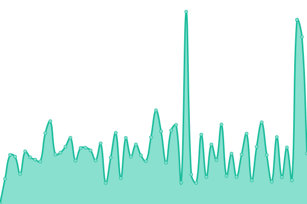
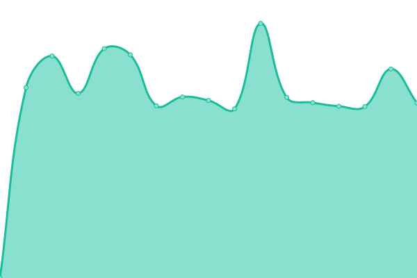

# [📈 Live Status](https://monitor2.ivancarlos.com.br): <!--live status--> **🟧 Partial outage**

This repository contains the open-source uptime monitor and status page for [Ivan Carlos](https://ivancarlos.me), powered by [Upptime](https://github.com/upptime/upptime).

With [Upptime](https://upptime.js.org), you can get your own unlimited and free uptime monitor and status page, powered entirely by a GitHub repository. We use [Issues](https://github.com/ivancarlos-me/Uptime-by-GitHub/issues) as incident reports, [Actions](https://github.com/ivancarlos-me/Uptime-by-GitHub/actions) as uptime monitors, and [Pages](https://monitor2.ivancarlos.com.br) for the status page.

<!--start: status pages-->
<!-- This summary is generated by Upptime (https://github.com/upptime/upptime) -->
<!-- Do not edit this manually, your changes will be overwritten -->
<!-- prettier-ignore -->
| URL | Status | History | Response Time | Uptime |
| --- | ------ | ------- | ------------- | ------ |
|  [UptimeRobot](https://uptimerobot.com) | 🟩 Up | [uptime-robot.yml](https://github.com/ivancarlos-me/Uptime-by-GitHub/commits/HEAD/history/uptime-robot.yml) | 

 622ms
     
 | 

<a href="https://monitor2.ivancarlos.com.br/history/uptime-robot">100.00%</a>
    

|  [Punto.alerta](https://alerta.org.br) | 🟩 Up | [punto-alerta.yml](https://github.com/ivancarlos-me/Uptime-by-GitHub/commits/HEAD/history/punto-alerta.yml) | 

 2180ms
     
 | 

<a href="https://monitor2.ivancarlos.com.br/history/punto-alerta">100.00%</a>
    

|  [SP4.sp4com](https://sp4com.com.br) | 🟩 Up | [sp-4-sp4com.yml](https://github.com/ivancarlos-me/Uptime-by-GitHub/commits/HEAD/history/sp-4-sp4com.yml) | 

 8569ms
     
 | 

<a href="https://monitor2.ivancarlos.com.br/history/sp-4-sp4com">100.00%</a>
    

|  [SP4.sp4comunicacao](https://sp4comunicacao.com.br) | 🟩 Up | [sp-4-sp4comunicacao.yml](https://github.com/ivancarlos-me/Uptime-by-GitHub/commits/HEAD/history/sp-4-sp4comunicacao.yml) | 

 5750ms
     
 | 

<a href="https://monitor2.ivancarlos.com.br/history/sp-4-sp4comunicacao">100.00%</a>
    

|  [iccsv05](iccsv05.ivancarlos.com.br) | 🟥 Down | [iccsv05.yml](https://github.com/ivancarlos-me/Uptime-by-GitHub/commits/HEAD/history/iccsv05.yml) | 

 119ms
     
 | 

<a href="https://monitor2.ivancarlos.com.br/history/iccsv05">0.00%</a>
    

<!--end: status pages-->

[**Visit our status website →**](https://monitor2.ivancarlos.com.br)

## 📄 License

- Powered by: [Upptime](https://github.com/upptime/upptime)
- Code: [MIT](./LICENSE) © [Anand Chowdhary](https://anandchowdhary.com), supported by [Pabio](https://pabio.com)
- Data in the `./history` directory: [Open Database License](https://opendatacommons.org/licenses/odbl/1-0/)
