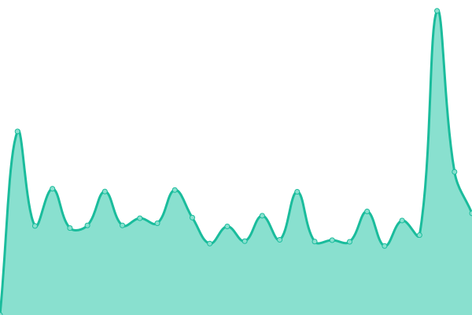
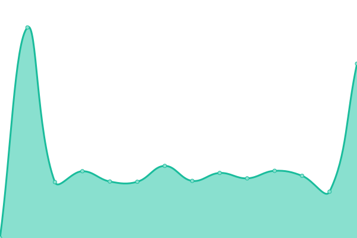
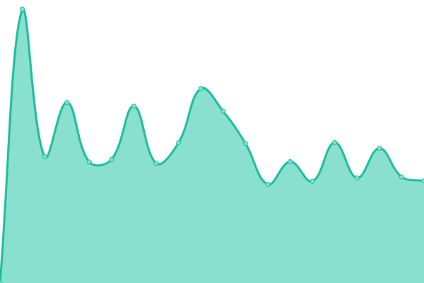
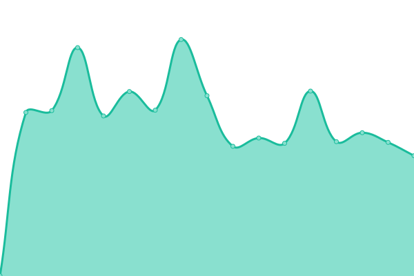
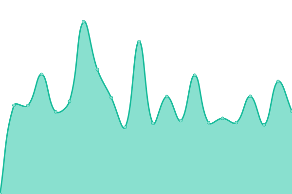
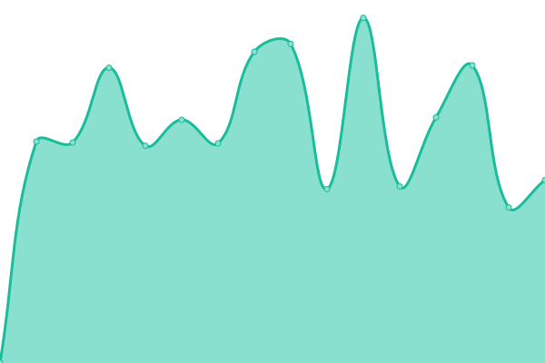
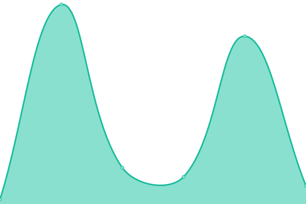

# [📈 Live Status](https://monitor2.ivancarlos.com.br): <!--live status--> **🟧 Partial outage**

This repository contains the open-source uptime monitor and status page for [Ivan Carlos](https://ivancarlos.me).

<!--start: status pages-->
<!-- This summary is generated by Upptime (https://github.com/upptime/upptime) -->
<!-- Do not edit this manually, your changes will be overwritten -->
<!-- prettier-ignore -->
| URL | Status | History | Response Time | Uptime |
| --- | ------ | ------- | ------------- | ------ |
|  [UptimeRobot](https://uptimerobot.com) | 🟩 Up | [uptime-robot.yml](https://github.com/ivancarlos-me/Uptime-by-GitHub/commits/HEAD/history/uptime-robot.yml) | 

 656ms
     
 | 

<a href="https://monitor2.ivancarlos.com.br/history/uptime-robot">100.00%</a>
    

|  [Punto.alerta](https://alerta.org.br) | 🟩 Up | [punto-alerta.yml](https://github.com/ivancarlos-me/Uptime-by-GitHub/commits/HEAD/history/punto-alerta.yml) | 

 2191ms
     
 | 

<a href="https://monitor2.ivancarlos.com.br/history/punto-alerta">100.00%</a>
    

|  [SP4.sp4com](https://sp4com.com.br) | 🟩 Up | [sp-4-sp4com.yml](https://github.com/ivancarlos-me/Uptime-by-GitHub/commits/HEAD/history/sp-4-sp4com.yml) | 

 7951ms
     
 | 

<a href="https://monitor2.ivancarlos.com.br/history/sp-4-sp4com">93.42%</a>
    

|  [SP4.sp4comunicacao](https://sp4comunicacao.com.br/en) | 🟩 Up | [sp-4-sp4comunicacao.yml](https://github.com/ivancarlos-me/Uptime-by-GitHub/commits/HEAD/history/sp-4-sp4comunicacao.yml) | 

 5388ms
     
 | 

<a href="https://monitor2.ivancarlos.com.br/history/sp-4-sp4comunicacao">100.00%</a>
    

|  [ICC.iccsv01](https://iccsv01.ivancarlos.com.br/login) | 🟩 Up | [icc-iccsv01.yml](https://github.com/ivancarlos-me/Uptime-by-GitHub/commits/HEAD/history/icc-iccsv01.yml) | 

 775ms
     
 | 

<a href="https://monitor2.ivancarlos.com.br/history/icc-iccsv01">100.00%</a>
    

|  [ICC.iccsv02](https://iccsv02.ivancarlos.com.br/login) | 🟩 Up | [icc-iccsv02.yml](https://github.com/ivancarlos-me/Uptime-by-GitHub/commits/HEAD/history/icc-iccsv02.yml) | 

 870ms
     
 | 

<a href="https://monitor2.ivancarlos.com.br/history/icc-iccsv02">100.00%</a>
    

|  [ICC.iccsv03](https://iccsv03.ivancarlos.com.br/login) | 🟩 Up | [icc-iccsv03.yml](https://github.com/ivancarlos-me/Uptime-by-GitHub/commits/HEAD/history/icc-iccsv03.yml) | 

 898ms
     
 | 

<a href="https://monitor2.ivancarlos.com.br/history/icc-iccsv03">100.00%</a>
    

|  [ICC.iccsv04](https://iccsv04.ivancarlos.com.br/login) | 🟩 Up | [icc-iccsv04.yml](https://github.com/ivancarlos-me/Uptime-by-GitHub/commits/HEAD/history/icc-iccsv04.yml) | 

 1034ms
     
 | 

<a href="https://monitor2.ivancarlos.com.br/history/icc-iccsv04">100.00%</a>
    

|  [ICC.iccsv05](https://iccsv05.ivancarlos.com.br/login) | 🟩 Up | [icc-iccsv05.yml](https://github.com/ivancarlos-me/Uptime-by-GitHub/commits/HEAD/history/icc-iccsv05.yml) | 

 896ms
     
 | 

<a href="https://monitor2.ivancarlos.com.br/history/icc-iccsv05">100.00%</a>
    

|  [ICC.iccsv06](https://iccsv06.ivancarlos.com.br/login) | 🟩 Up | [icc-iccsv06.yml](https://github.com/ivancarlos-me/Uptime-by-GitHub/commits/HEAD/history/icc-iccsv06.yml) | 

 845ms
     
 | 

<a href="https://monitor2.ivancarlos.com.br/history/icc-iccsv06">100.00%</a>
    

|  [Bowler.bowlersv01](https://bowlersv01.bowler.com.br/login) | 🟩 Up | [bowler-bowlersv01.yml](https://github.com/ivancarlos-me/Uptime-by-GitHub/commits/HEAD/history/bowler-bowlersv01.yml) | 

 725ms
     
 | 

<a href="https://monitor2.ivancarlos.com.br/history/bowler-bowlersv01">91.81%</a>
    

|  [Punto.puntosv09](https://puntosv09.puntocomunicacao.com.br/login) | 🟩 Up | [punto-puntosv09.yml](https://github.com/ivancarlos-me/Uptime-by-GitHub/commits/HEAD/history/punto-puntosv09.yml) | 

 806ms
     
 | 

<a href="https://monitor2.ivancarlos.com.br/history/punto-puntosv09">100.00%</a>
    

|  [Punto.puntosv10](https://puntosv10.puntocomunicacao.com.br/login) | 🟩 Up | [punto-puntosv10.yml](https://github.com/ivancarlos-me/Uptime-by-GitHub/commits/HEAD/history/punto-puntosv10.yml) | 

 786ms
     
 | 

<a href="https://monitor2.ivancarlos.com.br/history/punto-puntosv10">100.00%</a>
    

|  [Punto.oxfamsv01](https://oxfamsv01.oxfam.org.br/login) | 🟩 Up | [punto-oxfamsv01.yml](https://github.com/ivancarlos-me/Uptime-by-GitHub/commits/HEAD/history/punto-oxfamsv01.yml) | 

 683ms
     
 | 

<a href="https://monitor2.ivancarlos.com.br/history/punto-oxfamsv01">100.00%</a>
    

|  [FBSP.fbspsv03](https://fbspsv03.forumseguranca.org.br/login) | 🟩 Up | [fbsp-fbspsv03.yml](https://github.com/ivancarlos-me/Uptime-by-GitHub/commits/HEAD/history/fbsp-fbspsv03.yml) | 

 698ms
     
 | 

<a href="https://monitor2.ivancarlos.com.br/history/fbsp-fbspsv03">100.00%</a>
    

|  [FBSP.fbspsv04](https://fbspsv04.forumseguranca.org.br/login) | 🟩 Up | [fbsp-fbspsv04.yml](https://github.com/ivancarlos-me/Uptime-by-GitHub/commits/HEAD/history/fbsp-fbspsv04.yml) | 

 807ms
     
 | 

<a href="https://monitor2.ivancarlos.com.br/history/fbsp-fbspsv04">100.00%</a>
    

|  [FBSP.fbspsv05](https://fbspsv05.forumseguranca.org.br/login) | 🟩 Up | [fbsp-fbspsv05.yml](https://github.com/ivancarlos-me/Uptime-by-GitHub/commits/HEAD/history/fbsp-fbspsv05.yml) | 

 775ms
     
 | 

<a href="https://monitor2.ivancarlos.com.br/history/fbsp-fbspsv05">100.00%</a>
    

|  [Bowler normal site](https://bowler.com.br) | 🟩 Up | [bowler-normal-site.yml](https://github.com/ivancarlos-me/Uptime-by-GitHub/commits/HEAD/history/bowler-normal-site.yml) | 

 274ms
     
 | 

<a href="https://monitor2.ivancarlos.com.br/history/bowler-normal-site">100.00%</a>
    

|  [ICC v6 test](ivancarlos.com.br) | 🟥 Down | [icc-v6-test.yml](https://github.com/ivancarlos-me/Uptime-by-GitHub/commits/HEAD/history/icc-v6-test.yml) | 

 26ms
     
 | 

<a href="https://monitor2.ivancarlos.com.br/history/icc-v6-test">0.00%</a>
    

|  [Bowler v6 test](bowler.com.br) | 🟥 Down | [bowler-v6-test.yml](https://github.com/ivancarlos-me/Uptime-by-GitHub/commits/HEAD/history/bowler-v6-test.yml) | 

 0ms
     
 | 

<a href="https://monitor2.ivancarlos.com.br/history/bowler-v6-test">0.00%</a>
    

<!--end: status pages-->

[**Visit our status website →**](https://monitor2.ivancarlos.com.br)
