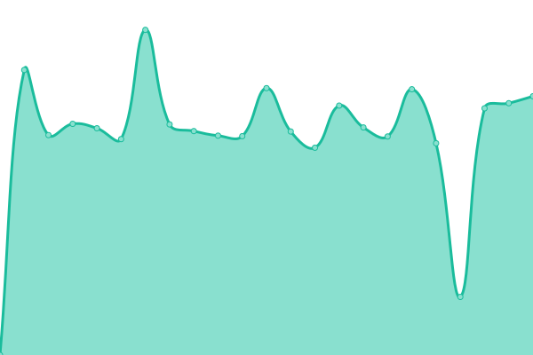

# [📈 Live Status](https://monitor2.ivancarlos.com.br): <!--live status--> **🟧 Partial outage**

This repository contains the open-source uptime monitor and status page for [Ivan Carlos](https://ivancarlos.me), powered by [Upptime](https://github.com/upptime/upptime).

With [Upptime](https://upptime.js.org), you can get your own unlimited and free uptime monitor and status page, powered entirely by a GitHub repository. We use [Issues](https://github.com/ivancarlos-me/Uptime-by-GitHub/issues) as incident reports, [Actions](https://github.com/ivancarlos-me/Uptime-by-GitHub/actions) as uptime monitors, and [Pages](https://monitor2.ivancarlos.com.br) for the status page.

<!--start: status pages-->
<!-- This summary is generated by Upptime (https://github.com/upptime/upptime) -->
<!-- Do not edit this manually, your changes will be overwritten -->
<!-- prettier-ignore -->
| URL | Status | History | Response Time | Uptime |
| --- | ------ | ------- | ------------- | ------ |
|  [UptimeRobot](https://uptimerobot.com) | 🟩 Up | [uptime-robot.yml](https://github.com/ivancarlos-me/Uptime-by-GitHub/commits/HEAD/history/uptime-robot.yml) | 

 649ms
     
 | 

<a href="https://monitor2.ivancarlos.com.br/history/uptime-robot">100.00%</a>
    

|  [Punto.alerta](https://alerta.org.br) | 🟩 Up | [punto-alerta.yml](https://github.com/ivancarlos-me/Uptime-by-GitHub/commits/HEAD/history/punto-alerta.yml) | 

 2231ms
     
 | 

<a href="https://monitor2.ivancarlos.com.br/history/punto-alerta">100.00%</a>
    

|  [SP4.sp4com](https://sp4com.com.br) | 🟩 Up | [sp-4-sp4com.yml](https://github.com/ivancarlos-me/Uptime-by-GitHub/commits/HEAD/history/sp-4-sp4com.yml) | 

 8093ms
     
 | 

<a href="https://monitor2.ivancarlos.com.br/history/sp-4-sp4com">100.00%</a>
    

|  [SP4.sp4comunicacao](https://sp4comunicacao.com.br) | 🟩 Up | [sp-4-sp4comunicacao.yml](https://github.com/ivancarlos-me/Uptime-by-GitHub/commits/HEAD/history/sp-4-sp4comunicacao.yml) | 

 5453ms
     
 | 

<a href="https://monitor2.ivancarlos.com.br/history/sp-4-sp4comunicacao">100.00%</a>
    

|  [ICC.iccsv01](https://iccsv01.ivancarlos.com.br) | 🟩 Up | [icc-iccsv01.yml](https://github.com/ivancarlos-me/Uptime-by-GitHub/commits/HEAD/history/icc-iccsv01.yml) | 

 1082ms
     
 | 

<a href="https://monitor2.ivancarlos.com.br/history/icc-iccsv01">100.00%</a>
    

|  [ICC.iccsv02](https://iccsv02.ivancarlos.com.br) | 🟩 Up | [icc-iccsv02.yml](https://github.com/ivancarlos-me/Uptime-by-GitHub/commits/HEAD/history/icc-iccsv02.yml) | 

 1411ms
     
 | 

<a href="https://monitor2.ivancarlos.com.br/history/icc-iccsv02">100.00%</a>
    

|  [ICC.iccsv03](https://iccsv03.ivancarlos.com.br) | 🟩 Up | [icc-iccsv03.yml](https://github.com/ivancarlos-me/Uptime-by-GitHub/commits/HEAD/history/icc-iccsv03.yml) | 

 1076ms
     
 | 

<a href="https://monitor2.ivancarlos.com.br/history/icc-iccsv03">100.00%</a>
    

|  [ICC.iccsv04](https://iccsv04.ivancarlos.com.br) | 🟩 Up | [icc-iccsv04.yml](https://github.com/ivancarlos-me/Uptime-by-GitHub/commits/HEAD/history/icc-iccsv04.yml) | 

 1949ms
     
 | 

<a href="https://monitor2.ivancarlos.com.br/history/icc-iccsv04">100.00%</a>
    

|  [ICC.iccsv05](https://iccsv05.ivancarlos.com.br) | 🟩 Up | [icc-iccsv05.yml](https://github.com/ivancarlos-me/Uptime-by-GitHub/commits/HEAD/history/icc-iccsv05.yml) | 

 1680ms
     
 | 

<a href="https://monitor2.ivancarlos.com.br/history/icc-iccsv05">100.00%</a>
    

|  [ICC.iccsv06](https://iccsv06.ivancarlos.com.br) | 🟩 Up | [icc-iccsv06.yml](https://github.com/ivancarlos-me/Uptime-by-GitHub/commits/HEAD/history/icc-iccsv06.yml) | 

 1434ms
     
 | 

<a href="https://monitor2.ivancarlos.com.br/history/icc-iccsv06">100.00%</a>
    

|  [Bowler.bowlersv01](https://bowlersb01.bowler.com.br) | 🟥 Down | [bowler-bowlersv01.yml](https://github.com/ivancarlos-me/Uptime-by-GitHub/commits/HEAD/history/bowler-bowlersv01.yml) | 

 0ms
     
 | 

<a href="https://monitor2.ivancarlos.com.br/history/bowler-bowlersv01">0.13%</a>
    

|  [Punto.puntosv09](https://puntosv09.puntocomunicacao.com.br) | 🟩 Up | [punto-puntosv09.yml](https://github.com/ivancarlos-me/Uptime-by-GitHub/commits/HEAD/history/punto-puntosv09.yml) | 

 1387ms
     
 | 

<a href="https://monitor2.ivancarlos.com.br/history/punto-puntosv09">100.00%</a>
    

|  [Punto.puntosv10](https://puntosv10.puntocomunicacao.com.br) | 🟩 Up | [punto-puntosv10.yml](https://github.com/ivancarlos-me/Uptime-by-GitHub/commits/HEAD/history/punto-puntosv10.yml) | 

 1131ms
     
 | 

<a href="https://monitor2.ivancarlos.com.br/history/punto-puntosv10">100.00%</a>
    

|  [ICC v6](https://ivancarlos.com.br) | 🟥 Down | [icc-v6.yml](https://github.com/ivancarlos-me/Uptime-by-GitHub/commits/HEAD/history/icc-v6.yml) | 

 1314ms
     
 | 

<a href="https://monitor2.ivancarlos.com.br/history/icc-v6">98.60%</a>
    

|  [Bowler v6](https://bowler.com.br) | 🟥 Down | [bowler-v6.yml](https://github.com/ivancarlos-me/Uptime-by-GitHub/commits/HEAD/history/bowler-v6.yml) | 

 710ms
     
 | 

<a href="https://monitor2.ivancarlos.com.br/history/bowler-v6">99.07%</a>
    

<!--end: status pages-->

[**Visit our status website →**](https://monitor2.ivancarlos.com.br)

## 📄 License

- Powered by: [Upptime](https://github.com/upptime/upptime)
- Code: [MIT](./LICENSE) © [Anand Chowdhary](https://anandchowdhary.com), supported by [Pabio](https://pabio.com)
- Data in the `./history` directory: [Open Database License](https://opendatacommons.org/licenses/odbl/1-0/)
