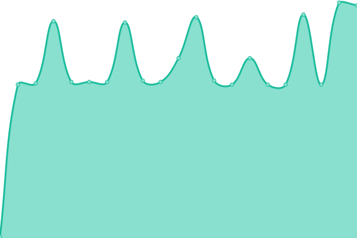
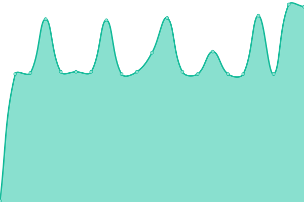

# [📈 Live Status](https://monitor2.ivancarlos.com.br): <!--live status--> **🟩 All systems operational**

This repository contains the open-source uptime monitor and status page for [Ivan Carlos](https://ivancarlos.me).

<!--start: status pages-->
<!-- This summary is generated by Upptime (https://github.com/upptime/upptime) -->
<!-- Do not edit this manually, your changes will be overwritten -->
<!-- prettier-ignore -->
| URL | Status | History | Response Time | Uptime |
| --- | ------ | ------- | ------------- | ------ |
|  [UptimeRobot](https://uptimerobot.com) | 🟩 Up | [uptime-robot.yml](https://github.com/ivancarlos-me/Uptime-by-GitHub/commits/HEAD/history/uptime-robot.yml) | 

 689ms
     
 | 

<a href="https://monitor2.ivancarlos.com.br/history/uptime-robot">100.00%</a>
    

|  [Punto.alerta](https://alerta.org.br) | 🟩 Up | [punto-alerta.yml](https://github.com/ivancarlos-me/Uptime-by-GitHub/commits/HEAD/history/punto-alerta.yml) | 

 2371ms
     
 | 

<a href="https://monitor2.ivancarlos.com.br/history/punto-alerta">100.00%</a>
    

|  [SP4.sp4com](https://sp4com.com.br) | 🟩 Up | [sp-4-sp4com.yml](https://github.com/ivancarlos-me/Uptime-by-GitHub/commits/HEAD/history/sp-4-sp4com.yml) | 

 7956ms
     
 | 

<a href="https://monitor2.ivancarlos.com.br/history/sp-4-sp4com">96.55%</a>
    

|  [SP4.sp4comunicacao](https://sp4comunicacao.com.br/en) | 🟩 Up | [sp-4-sp4comunicacao.yml](https://github.com/ivancarlos-me/Uptime-by-GitHub/commits/HEAD/history/sp-4-sp4comunicacao.yml) | 

 5424ms
     
 | 

<a href="https://monitor2.ivancarlos.com.br/history/sp-4-sp4comunicacao">100.00%</a>
    

|  [Bowler.bowlersv01.cp](bowlersv01.bowler.com.br) | 🟩 Up | [bowler-bowlersv01-cp.yml](https://github.com/ivancarlos-me/Uptime-by-GitHub/commits/HEAD/history/bowler-bowlersv01-cp.yml) | 

 734ms
     
 | 

<a href="https://monitor2.ivancarlos.com.br/history/bowler-bowlersv01-cp">100.00%</a>
    

|  [Punto.puntosv01.cp](puntosv01.puntocomunicacao.com.br) | 🟩 Up | [punto-puntosv01-cp.yml](https://github.com/ivancarlos-me/Uptime-by-GitHub/commits/HEAD/history/punto-puntosv01-cp.yml) | 

 133ms
     
 | 

<a href="https://monitor2.ivancarlos.com.br/history/punto-puntosv01-cp">3.61%</a>
    

|  [Punto.puntosv06.cp](puntosv06.puntocomunicacao.com.br) | 🟩 Up | [punto-puntosv06-cp.yml](https://github.com/ivancarlos-me/Uptime-by-GitHub/commits/HEAD/history/punto-puntosv06-cp.yml) | 

 832ms
     
 | 

<a href="https://monitor2.ivancarlos.com.br/history/punto-puntosv06-cp">100.00%</a>
    

|  [Punto.puntosv07.cp](puntosv07.puntocomunicacao.com.br) | 🟩 Up | [punto-puntosv07-cp.yml](https://github.com/ivancarlos-me/Uptime-by-GitHub/commits/HEAD/history/punto-puntosv07-cp.yml) | 

 1093ms
     
 | 

<a href="https://monitor2.ivancarlos.com.br/history/punto-puntosv07-cp">100.00%</a>
    

|  [Punto.puntosv08.cp](puntosv08.puntocomunicacao.com.br) | 🟩 Up | [punto-puntosv08-cp.yml](https://github.com/ivancarlos-me/Uptime-by-GitHub/commits/HEAD/history/punto-puntosv08-cp.yml) | 

 503ms
     
 | 

<a href="https://monitor2.ivancarlos.com.br/history/punto-puntosv08-cp">1.60%</a>
    

|  [Punto.puntosv09.cp](puntosv09.puntocomunicacao.com.br) | 🟩 Up | [punto-puntosv09-cp.yml](https://github.com/ivancarlos-me/Uptime-by-GitHub/commits/HEAD/history/punto-puntosv09-cp.yml) | 

 711ms
     
 | 

<a href="https://monitor2.ivancarlos.com.br/history/punto-puntosv09-cp">100.00%</a>
    

|  [Punto.puntosv10.cp](puntosv10.puntocomunicacao.com.br) | 🟩 Up | [punto-puntosv10-cp.yml](https://github.com/ivancarlos-me/Uptime-by-GitHub/commits/HEAD/history/punto-puntosv10-cp.yml) | 

 642ms
     
 | 

<a href="https://monitor2.ivancarlos.com.br/history/punto-puntosv10-cp">100.00%</a>
    

|  [Punto.oxfamsv01.cp](oxfamsv01.oxfam.org.br) | 🟩 Up | [punto-oxfamsv01-cp.yml](https://github.com/ivancarlos-me/Uptime-by-GitHub/commits/HEAD/history/punto-oxfamsv01-cp.yml) | 

 714ms
     
 | 

<a href="https://monitor2.ivancarlos.com.br/history/punto-oxfamsv01-cp">100.00%</a>
    

|  [Punto.oxfamsv02.cp](oxfamsv02.oxfam.org.br) | 🟩 Up | [punto-oxfamsv02-cp.yml](https://github.com/ivancarlos-me/Uptime-by-GitHub/commits/HEAD/history/punto-oxfamsv02-cp.yml) | 

 1250ms
     
 | 

<a href="https://monitor2.ivancarlos.com.br/history/punto-oxfamsv02-cp">100.00%</a>
    

|  [FBSP.fbspsv01.cp](fbspsv01.forumseguranca.org.br) | 🟩 Up | [fbsp-fbspsv01-cp.yml](https://github.com/ivancarlos-me/Uptime-by-GitHub/commits/HEAD/history/fbsp-fbspsv01-cp.yml) | 

 1457ms
     
 | 

<a href="https://monitor2.ivancarlos.com.br/history/fbsp-fbspsv01-cp">100.00%</a>
    

|  [FBSP.fbspsv02.cp](fbspsv02.forumseguranca.org.br) | 🟩 Up | [fbsp-fbspsv02-cp.yml](https://github.com/ivancarlos-me/Uptime-by-GitHub/commits/HEAD/history/fbsp-fbspsv02-cp.yml) | 

 135ms
     
 | 

<a href="https://monitor2.ivancarlos.com.br/history/fbsp-fbspsv02-cp">1.05%</a>
    

|  [FBSP.fbspsv03.cp](fbspsv03.forumseguranca.org.br) | 🟩 Up | [fbsp-fbspsv03-cp.yml](https://github.com/ivancarlos-me/Uptime-by-GitHub/commits/HEAD/history/fbsp-fbspsv03-cp.yml) | 

 738ms
     
 | 

<a href="https://monitor2.ivancarlos.com.br/history/fbsp-fbspsv03-cp">100.00%</a>
    

|  [FBSP.fbspsv04.cp](fbspsv04.forumseguranca.org.br) | 🟩 Up | [fbsp-fbspsv04-cp.yml](https://github.com/ivancarlos-me/Uptime-by-GitHub/commits/HEAD/history/fbsp-fbspsv04-cp.yml) | 

 1067ms
     
 | 

<a href="https://monitor2.ivancarlos.com.br/history/fbsp-fbspsv04-cp">100.00%</a>
    

|  [FBSP.fbspsv05.cp](fbspsv05.forumseguranca.org.br) | 🟩 Up | [fbsp-fbspsv05-cp.yml](https://github.com/ivancarlos-me/Uptime-by-GitHub/commits/HEAD/history/fbsp-fbspsv05-cp.yml) | 

 804ms
     
 | 

<a href="https://monitor2.ivancarlos.com.br/history/fbsp-fbspsv05-cp">100.00%</a>
    

|  [ICC.iccsv01.cp](iccsv01.ivancarlos.com.br) | 🟩 Up | [icc-iccsv01-cp.yml](https://github.com/ivancarlos-me/Uptime-by-GitHub/commits/HEAD/history/icc-iccsv01-cp.yml) | 

 790ms
     
 | 

<a href="https://monitor2.ivancarlos.com.br/history/icc-iccsv01-cp">100.00%</a>
    

|  [ICC.iccsv02.cp](iccsv02.ivancarlos.com.br) | 🟩 Up | [icc-iccsv02-cp.yml](https://github.com/ivancarlos-me/Uptime-by-GitHub/commits/HEAD/history/icc-iccsv02-cp.yml) | 

 901ms
     
 | 

<a href="https://monitor2.ivancarlos.com.br/history/icc-iccsv02-cp">100.00%</a>
    

|  [ICC.iccsv03.cp](iccsv03.ivancarlos.com.br) | 🟩 Up | [icc-iccsv03-cp.yml](https://github.com/ivancarlos-me/Uptime-by-GitHub/commits/HEAD/history/icc-iccsv03-cp.yml) | 

 1017ms
     
 | 

<a href="https://monitor2.ivancarlos.com.br/history/icc-iccsv03-cp">100.00%</a>
    

|  [ICC.iccsv04.cp](iccsv04.ivancarlos.com.br) | 🟩 Up | [icc-iccsv04-cp.yml](https://github.com/ivancarlos-me/Uptime-by-GitHub/commits/HEAD/history/icc-iccsv04-cp.yml) | 

 1425ms
     
 | 

<a href="https://monitor2.ivancarlos.com.br/history/icc-iccsv04-cp">100.00%</a>
    

|  [ICC.iccsv05.cp](iccsv05.ivancarlos.com.br) | 🟩 Up | [icc-iccsv05-cp.yml](https://github.com/ivancarlos-me/Uptime-by-GitHub/commits/HEAD/history/icc-iccsv05-cp.yml) | 

 774ms
     
 | 

<a href="https://monitor2.ivancarlos.com.br/history/icc-iccsv05-cp">100.00%</a>
    

|  [ICC.iccsv06.cp](iccsv06.ivancarlos.com.br) | 🟩 Up | [icc-iccsv06-cp.yml](https://github.com/ivancarlos-me/Uptime-by-GitHub/commits/HEAD/history/icc-iccsv06-cp.yml) | 

 653ms
     
 | 

<a href="https://monitor2.ivancarlos.com.br/history/icc-iccsv06-cp">100.00%</a>
    

<!--end: status pages-->

[**Monitor2 de Status →**](https://monitor2.ivancarlos.com.br)
